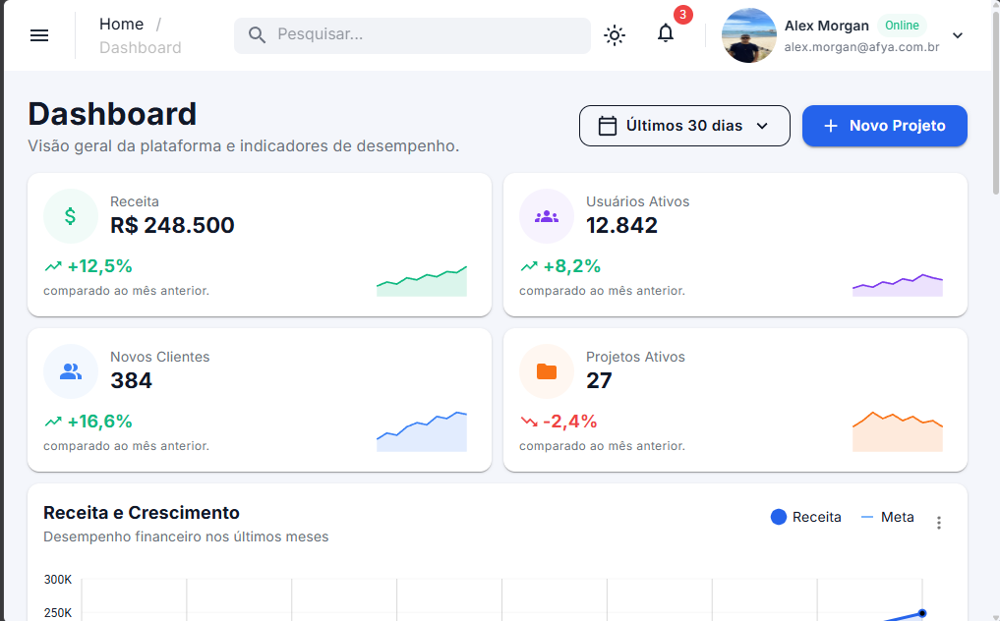
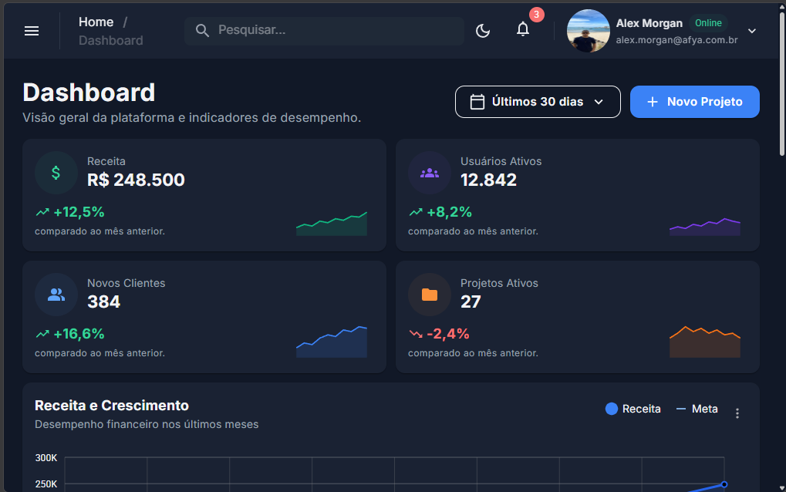
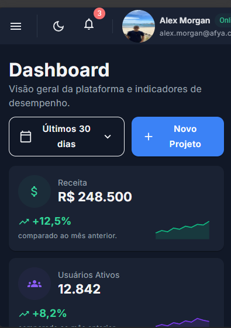
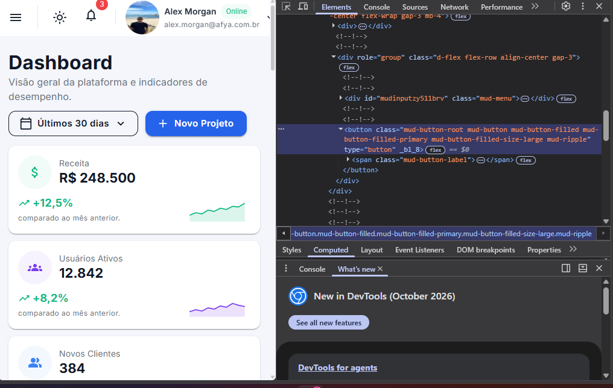
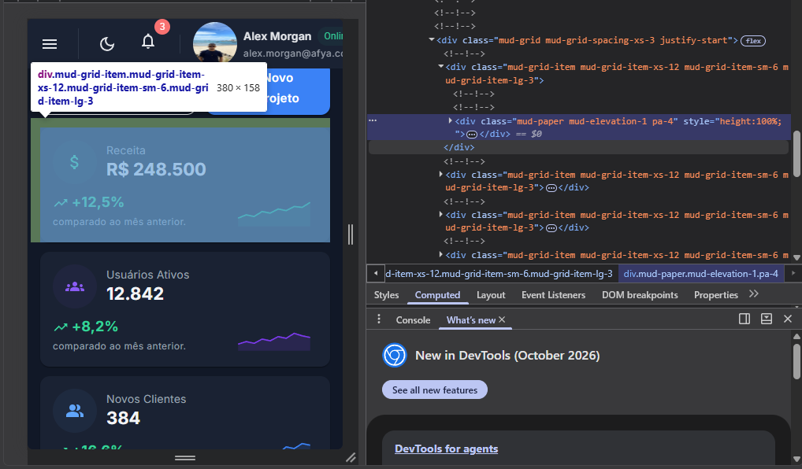

# Afya Admin — Dashboard com Blazor WebAssembly e MudBlazor


## Identificação

| | |
|---|---|
| **Aluno(a)** | Isac Alves de Lima Silva |
| **Matrícula** | 000000 |
| **Faculdade** | Afya - São Lucas |
| **Curso** | Ciência da Computação |
| **Disciplina** | Programação de Sistemas Web |
| **Professor(a)** | Liluyoud Cury |
| **Semestre** | 2026.2 |

## Objetivo do projeto

O projeto é um Dashboard para o trabalho de programação web. A ideia é mostrar as principais informações do sistema de forma simples e organizada. A página tem um menu lateral para acessar outras áreas e uma barra superior com pesquisa, notificações, troca de tema e informações do usuário.

Na página principal são mostrados alguns números importantes, gráficos sobre a receita e os clientes, o andamento dos projetos e as atividades recentes. Também há uma tabela com os projetos mais recentes, mostrando informações como cliente, responsável, situação, progresso e prazo.

Os dados usados no projeto são fictícios e servem apenas para mostrar como a página funciona. Todo o visual foi feito usando o MudBlazor, sem criar um CSS próprio. Foram usados os recursos do próprio MudBlazor para montar os botões, menus, gráficos, tabelas, cards e outras partes da página.


## Tecnologias utilizadas

- .NET 10 / Blazor WebAssembly 
- MudBlazor
- C# e Razor
- Fonte Inter (Google Fonts), aplicada pelo tema
- Git e GitHub (versionamento)
- VS Code com C# Dev Kit

## Como executar

Pré-requisito: **.NET SDK 10** (confira com `dotnet --version`, que deve começar com `10.`).

```bash
git clone https://github.com/limadev27/afya-admin.git
dotnet watch
```

O terminal mostra a URL (algo como `http://localhost:porta-aleatoria`) Use a que aparecer.


## Telas

### Tema claro


### Tema escuro


### Versão mobile


### HTML gerado (DevTools)




Com a aplicação rodando, usei a aba Elements do DevTools (F12) para inspecionar um botão e um card de KPI.

**Botão "Novo Projeto".** O `<MudButton>` foi renderizado como uma tag `<button type="button">` com as classes `mud-button-root mud-button mud-button-filled mud-button-filled-primary mud-button-filled-size-large mud-ripple`. Cada parâmetro que escrevi no código virou uma classe: `Variant.Filled` gerou `mud-button-filled`, `Color.Primary` gerou `mud-button-filled-primary` e `Size.Large` gerou `mud-button-filled-size-large`. O texto do botão fica dentro de um `<span class="mud-button-label">`. Logo acima dele está o `<MudStack>` do `CabecalhoPagina`, renderizado como `<div role="group" class="d-flex flex-row align-center gap-3">`: `Row="true"` virou `flex-row`, `AlignItems.Center` virou `align-center` e `Spacing="3"` virou `gap-3`.

**Card de KPI "Receita".** O `<MudPaper>` virou um `<div class="mud-paper mud-elevation-1 pa-4" style="height:100%;">`: o parâmetro `Elevation="1"` gerou a classe `mud-elevation-1` e o `Height="100%"` virou o atributo `style`. A classe `pa-4`, que escrevi em `Class="pa-4"`, aparece no final da lista de classes, junto das geradas pelo MudBlazor, sem nenhuma alteração. Por fora do card está o `<MudItem xs="12" sm="6" lg="3">`, renderizado como `<div class="mud-grid-item mud-grid-item-xs-12 mud-grid-item-sm-6 mud-grid-item-lg-3">`, que é o que faz o card ocupar 12, 6 ou 3 colunas conforme a largura da tela.

**Conclusão.** A inspeção mostra que o Blazor transforma cada componente Razor em HTML comum (`div`, `button`, `span`) e converte os parâmetros em classes CSS do MudBlazor, enquanto as classes utilitárias que escrevo em `Class` são repassadas ao HTML final sem alteração. Por isso foi possível montar o visual sem escrever CSS próprio.

## Estrutura do projeto

```
afya-admin/
├── Components/
│   ├── AtividadesRecentes.razor
│   ├── CabecalhoPagina.razor
│   ├── DashboardCard.razor
│   ├── GraficoDistribuicaoClientes.razor
│   ├── GraficoReceita.razor
│   ├── KpiCard.razor
│   ├── PerformanceProjetos.razor
│   ├── ProjetosRecentes.razor
│   ├── SeletorPeriodo.razor
│   └── Ui.cs
├── Data/
│   └── DashboardData.cs
├── docs/
│   └── prints/
├── Layout/
│   ├── MainLayout.razor
│   └── NavMenu.razor
├── Pages/
│   ├── Dashboard.razor
│   └── NotFound.razor
├── Properties/launchSettings.json
├── wwwroot/
│   ├── css/app.css
│   ├── img/alex-morgan.jpg
│   └── index.html
├── _Imports.razor
├── afya-admin.csproj
├── App.razor
└── Program.cs
```

- `Components/`: componentes reutilizáveis que desenham cada bloco da tela, mais o `Ui.cs` com funções auxiliares de apresentação.
- `Data/`: modelos (records) e dados fictícios do dashboard.
- `Layout/`: a "moldura" da aplicação (`MainLayout` com AppBar e sidebar, e o `NavMenu`).
- `Pages/`: páginas com rota (`Dashboard` em `/` e `NotFound` para o 404).
- `wwwroot/`: arquivos estáticos servidos ao navegador (`index.html`, imagens, CSS do template).
- `docs/prints/`: imagens usadas neste README.

## Componentes criados

| Componente | Responsabilidade | Parâmetros que recebe |
|---|---|---|
| `DashboardCard` | Card base reutilizável: título, subtítulo, ações, menu "⋮" e conteúdo | `Titulo`, `Subtitulo`, `Acoes`, `Menu`, `ChildContent` |
| `CabecalhoPagina` | Título da página com subtítulo e botões à direita | `Titulo`, `Subtitulo`, `Acoes` |
| `SeletorPeriodo` | Menu em forma de botão para escolher o período | `Opcoes`, `Valor`, `ValorChanged` |
| `KpiCard` | Card de indicador com ícone, valor, variação e sparkline | `Kpi` |
| `GraficoReceita` | Gráfico de linha Receita x Meta | `Meses`, `Receita`, `Meta` |
| `GraficoDistribuicaoClientes` | Gráfico de rosca com o total no centro e legenda própria | `Total`, `Segmentos` |
| `PerformanceProjetos` | Lista de projetos com barras de progresso | `Projetos` |
| `AtividadesRecentes` | Feed de atividades da equipe | `Atividades` |
| `ProjetosRecentes` | Tabela de projetos recentes | `Projetos` |

## O que aprendi

> Responda com suas próprias palavras, mencionando o SEU projeto (nomes de arquivos, componentes, trechos que você digitou). Um parágrafo curto por pergunta.

**1. Como uma aplicação Blazor WebAssembly inicia no navegador? Qual é o papel do `index.html`, da `<div id="app">` e do `Program.cs`?**

Uma aplicação Blazor WebAssembly começa carregando a página index.html no navegador. Esse arquivo é a primeira página que o navegador recebe e contém a estrutura básica da aplicação, além de carregar os arquivos necessários para iniciar o Blazor.

A <div id="app"> é o espaço onde a aplicação Blazor será exibida. Quando o Blazor é iniciado, ele encontra essa div e coloca dentro dela os componentes da aplicação, como páginas, menus e outros elementos.

Já o Program.cs é responsável por iniciar a aplicação Blazor. Nele, o projeto é configurado e os componentes principais são registrados. Também é onde serviços, como o MudBlazor, são adicionados. Resumindo: o index.html inicia a página, a <div id="app"> é onde o sistema aparece e o Program.cs configura e inicia o Blazor.

**2. Qual é a diferença entre um Layout, uma Page e um Component neste projeto? Dê um exemplo de cada.**

°Layout: define a estrutura geral. Ex.: MainLayout.razor.

°Page: representa uma tela acessada por uma URL. Ex.: Dashboard.razor.

°Component: é uma parte reutilizável da interface. Ex.: KpiCard.razor.

**3. O que é um `RenderFragment` e como o `DashboardCard` usa esse recurso para ser reutilizado por vários cards?**

RenderFragment permite colocar diferentes conteúdos dentro de um componente. No DashboardCard, ele permite reutilizar o mesmo modelo de card, mudando apenas o conteúdo de cada um.

**4. Como funciona o `@bind-Valor` no `SeletorPeriodo`? Qual é o papel do `ValorChanged`?**

O @bind-Valor conecta o valor escolhido no SeletorPeriodo com a variável _periodo. O ValorChanged avisa quando o valor muda e atualiza a variável.

**5. Por que os dados ficam na pasta `Data`, separados dos componentes? Que vantagem isso traz se, no futuro, os dados vierem de uma API?**

Para deixar os dados separados da parte visual do sistema. Assim, se no futuro os dados vierem de uma API, podemos trocar a fonte dos dados sem precisar alterar todos os componentes.

**6. Como o `MudGrid` com `xs`, `sm` e `lg` faz os cards de KPI se reorganizarem em telas de tamanhos diferentes?**

O xs, sm e lg definem quantos espaços cada card ocupa em diferentes tamanhos de tela. Assim, os cards conseguem se organizar automaticamente em telas pequenas, médias e grandes.

**7. Como foi possível estilizar a página inteira sem escrever CSS? Explique o papel do tema (`MudTheme`) e das classes utilitárias.**

Foi usado o MudTheme para definir cores, fontes e outros padrões visuais. Também foram usadas classes prontas do MudBlazor para espaçamento, alinhamento, tamanho e outras partes da aparência.

**8. Por que o namespace do projeto é `afya_admin` e não `afya-admin`?**

Porque o nome do projeto usa afya-admin, mas o C# não permite hífen em nomes de namespace. Por isso, o hífen é substituído por _, ficando afya_admin

## Dificuldades e soluções

1. Adaptar-me ao formato de sintaxe do Blazor:
No começo tive dificuldade para entender a forma correta de escrever os componentes e seus parâmetros. Resolvi isso seguindo o padrão do Blazor e organizando melhor as tags e os códigos.

2. Trabalhar sem CSS próprio:
Também tive dificuldade para montar o visual sem criar CSS personalizado. Resolvi usando os componentes, temas e classes prontas do MudBlazor para fazer os espaçamentos, cores e alinhamentos.

## Melhorias futuras (opcional)

Eu implementaria o período funcional, fazendo com que a troca de período no SeletorPeriodo alterasse os valores dos KPIs. Assim, o dashboard ficaria mais interativo e os dados apresentados mudariam de acordo com o período escolhido.